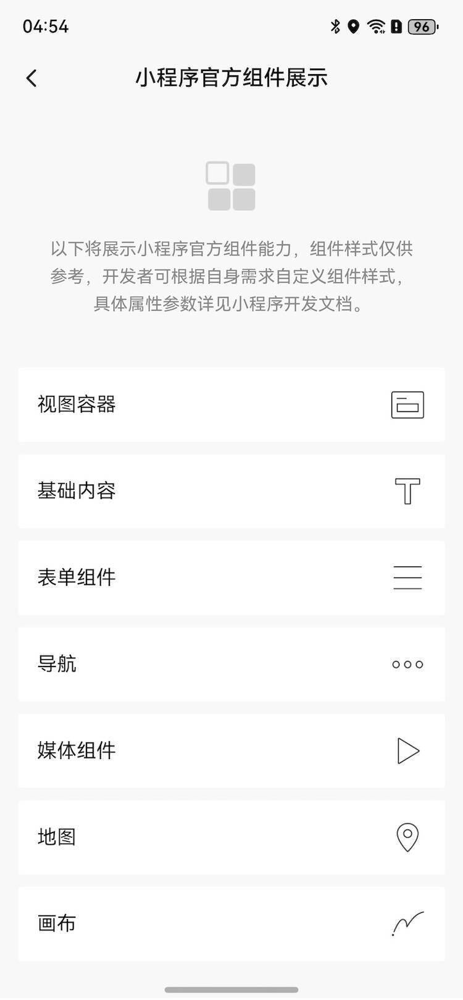

  

# Dimina - Didi's Open Source Cross-Platform Mini Program Framework

> Dimina is pronounced /diːminə/, short for didi miniprogram. It is designed to provide a flexible and lightweight cross-platform mini program framework.

[Introduction](#introduction) • [Showcase](#showcase) • [Getting Started](#getting-started) • [Contributing](#contributing) • [Star Trend](#star-trend) • [License](#license)

## Introduction

Dimina is a lightweight cross-platform mini program framework independently developed by Didi. It aims to offer developers a high-performance, cross-platform, and low-barrier development experience.

Currently, Dimina supports four major platforms: Android, iOS, Harmony, and Web. Developers can use Dimina as a **mobile cross-platform framework**—either integrating existing mini program logic as independent modules into current apps, or developing new features using mini program syntax and packaging them into standalone native apps.

## Showcase

Live Demo: <https://didi.github.io/dimina/>

| Android | iOS | Harmony |
| ---- | ---- | ---- |
|  |  |  |

## Getting Started

- [Mini Program Packaging Guide](./fe/packages/compiler/README.md)
- [Android Integration Guide](./android/README.md)
- [iOS Integration Guide](./iOS/README.md)
- [Harmony Integration Guide](./harmony/dimina/README.md)

## Contributing

Dimina is designed in accordance with the [Mini App Standard White Paper](https://www.w3.org/TR/mini-app-white-paper/) and has currently aligned with the main functionalities of the WeChat Mini Program.

For currently supported capabilities, see the [Dimina capability reference guide](./docs/API-Reference.md).

Benefiting from the high similarity between Vue3 and Mini Program syntax, the Dimina framework's underlying view rendering is built on Vue. The Dimina framework uses DMCC (./fe/packages/compiler/README.md) to transpile Mini Program syntax into Vue syntax, and based on this, it implements a complete Mini Program standard Vue component system. Ultimately, by implementing a native Mini Program container on the client side, it provides native capabilities while flexibly loading and displaying view pages.

To learn more about the principles of the underlying implementation of frameworks, please refer to the [documentation](./docs/README.md).

As the mini program ecosystem has evolved over the years, Dimina does not yet fully support all **APIs/components/features** of mini programs. Contributions and suggestions are highly welcome!

## Star Trend

If you find Dimina helpful, please click the ⭐Star button in the upper right to support us and help more people discover this project.

## License

Dimina is distributed and used under the [Apache-2.0](https://opensource.org/license/apache-2-0) license. For more details, please see the [LICENSE](LICENSE) file.
